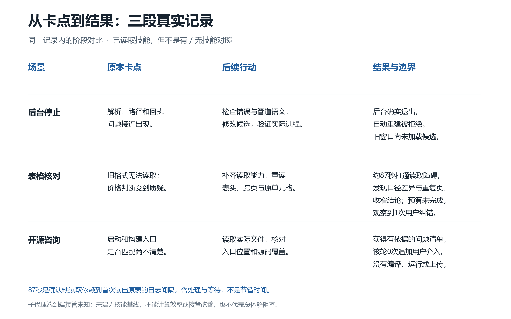
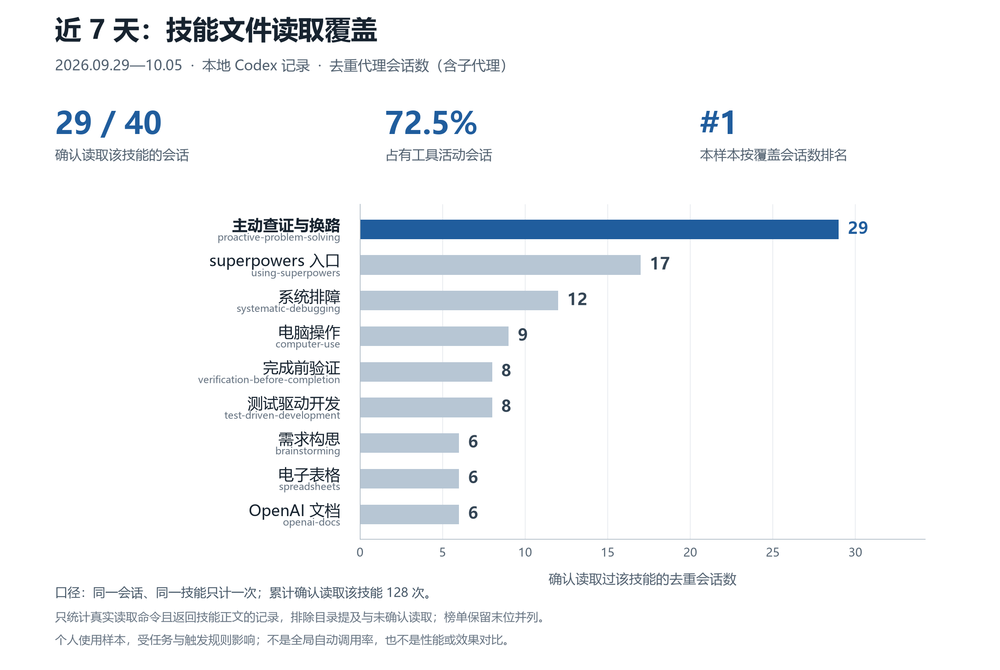

# 主动查证与换路

[English](README.en.md) · [技能原文](skills/proactive-problem-solving/SKILL.md) · [MIT License](LICENSE)

我自己日常使用的一个 AI 代理技能：遇到未知环节或实施障碍时，先做能区分原因的小验证，按实际证据调整路线，并在已有授权内继续完成工作。

我做它的直接原因是：任务一遇到问题就被标记为“受阻”，最后还得由我接管查资料、换方法和继续推进。它希望减少未经查证就停止、无效重复尝试，以及把能自行完成的步骤退回用户。

## 核心做法

1. **先定成功证据。** 确认目标、用户的硬约束，以及什么实际结果才算完成。
2. **先做小验证。** 把未知点改写成可检验的问题，用一个对象、一次动作和一次结果检查区分原因。
3. **按证据换路。** 同一假设两轮没有新证据或实质进展，就换观察点、测试对象或底层机制，而不是继续盲试。
4. **读回实际结果。** HTTP 200、工具返回成功、测试通过，都不能直接替代用户要的业务结果。
5. **继续推进已授权的工作。** 找到可行路线后，完成必要的实现、集成与验收；确实需要用户决定时才问最少必要问题。

适用于有未知环节的实施、排障和技术可行性任务。简单问答、翻译和纯文案不需要额外流程。

## 它对谁有用

如果你用代理调试软件、连接本地工具、处理文件或完成多步骤操作，并经常遇到下面的情况，可以试试这个技能：

| 你遇到的问题 | 它希望改变的下一步 |
| --- | --- |
| “这个工具报错，所以任务做不了” | 先明确失败的是哪一层，做一个能区分原因的小检查，再决定是否存在合规可行的路线 |
| 重试很多次，只是换参数或措辞 | 检查有没有获得新证据；没有就改变假设、观察点、测试对象或机制 |
| 接口返回成功，实际文件或对象没变 | 读回目标对象，检查内容、归属和实际业务结果 |
| 代理找到了办法，但把后续工作交回给你 | 在你已授权的范围内继续完成实现、集成和必要验证 |

“两轮无新证据”不是只能尝试两次，而是不继续重复验证同一个已经没有进展的假设。“持续推进”也不代表无限重试或越过权限。

## 怎么判断有没有帮上忙

先选一个你本来就要处理的具体障碍，写清目标和不能改变的条件，再显式调用技能。看它是否产生了新的、能区分原因的证据，是否据此改变了行动，以及最后有没有核验你要的实际结果。

有价值的信号是：原本含糊的障碍被定位、无效重试停止、可用路线被验证，或者确认了确实需要补充的权限/决策。读取次数、输出长度和“成功”提示都不能单独证明有效。若仍然卡住，应看到具体阻塞点和已完成部分，而不是没有依据的完成宣告。

如果要做使用前后比较，优先记录**可避免的受阻、用户纠错/接管、实际完成结果和完成耗时**。必要授权、用户改变需求和真正无法获得的外部条件应另列。当前历史样本不能证明接管次数下降或效率提升；[效果比较与记录口径](docs/evaluation.md) 提供了可复用的方法。

还补做了 [3 种任务的可重复增量对照](docs/comparison.md)：双方授权范围内产物 3/3 正确，可避免接手请求都是 0，耗时有快有慢。两组都继承已有查证规则，本次没有证明额外读取技能带来稳定效率或接手请求收益。公开输入、输出和数字，方便复核。

## 边界

“换路”是在现有约束和权限内更换验证或实施方法。它不授权绕过安全控制、不扩大访问范围，也不把登录状态当成可复用的合法工具权限。缺少权限、关键决策或必要外部条件时，应保留已完成的工作并准确说明限制。

这是工作流指导，不是新工具、后台服务或能力保证。实际效果取决于模型、可用工具、任务条件和用户约束；没有声称它能提高某个固定百分比的成功率。

## 在 Codex 中安装

最省事的方式是在 Codex 中发送：

```text
$skill-installer 从 https://github.com/baixing619/proactive-problem-solving 安装 skills/proactive-problem-solving
```

也可以下载仓库 ZIP，将其中 `skills/proactive-problem-solving` 整个文件夹放到：

- 个人技能目录：`~/.agents/skills/proactive-problem-solving`
- 项目技能目录：`<项目根目录>/.agents/skills/proactive-problem-solving`

Windows 的 `~` 指当前用户目录。不要只复制 `SKILL.md` 而丢掉 `agents/openai.yaml`。已有同名技能时先保留原版，选择一个安装位置，避免重复安装。

安装位置和显式/隐式选择方式参见 [OpenAI 官方技能文档](https://learn.chatgpt.com/docs/build-skills)。技能文件采用 [Agent Skills 文件格式](https://agentskills.io/specification)；其他代理是否识别 `agents/openai.yaml`、如何安装及触发，取决于各自宿主，未逐一验证。

## 使用

显式调用例子：

```text
使用 $proactive-problem-solving，查证当前障碍，做最小验证，并在已有约束和授权内持续推进到可核验的结果。
```

Codex 可以根据技能描述选择它；本仓库的 `allow_implicit_invocation` 保持为 `true`。这不保证每次都自动选中。

如果希望项目明确采用这个工作方式，可以按需要在项目的 `AGENTS.md` 加入：

```text
处理有未知环节的实施、排障或技术可行性任务时，读取并应用 proactive-problem-solving 技能。
出现实质障碍、同一假设连续两轮无新证据、用户纠正路线，或准备向用户求助/断言不可行时，重新检查技能中的决策要求。
此规则不扩大授权、不绕过安全控制；简单问答、翻译和纯文案无需额外流程。
```

## 小例子

| 遇到的情况 | 技能要求的下一步 |
| --- | --- |
| 一个工具接口报错 | 先区分工具暴露、调用方式、权限、传输还是业务结果出了问题，再检查可用替代路线 |
| 附件下载返回 200 | 检查实际文件内容、类型、归属和目标附件是否一致 |
| 同一请求换参数重试两轮仍无进展 | 改变测试对象、观察点或机制，验证不同的假设 |
| 原型实验成功 | 继续完成约定的集成和真实验收，报告仍未验证的部分 |

## 文件与许可证

可安装技能目录内只有 `SKILL.md` 和 `agents/openai.yaml`，不包含历史对话、私有路径、账号配置或凭据。中文技能原文是本次开源时日常使用版本的直接副本；英文 README 是说明，不是另一套技能指令。

本仓库使用 [MIT 许可证](LICENSE)，可使用、修改和再分发，请保留许可证和版权声明。

## 实际记录中的用途



复查实际工作记录，能看到有文件证据的发布前问题清单、后台进程确实退出的局部验证，以及发现数据口径不一致后收窄结论的过程。也能看到仍然偏题或未完成的情况。没有无技能对照，不能将这些例子归因为固定的效果提升。

详见 [实际观察、抽样方法和限制](docs/practical-observations.md)。第一次试用时，看它是否产生新证据、改变无效行动并核验实际结果。

## 补充：个人读取记录



北京时间 2026 年 9 月 29 日至 10 月 5 日的本地记录中，40 个有工具活动的代理会话里，29 个确认读取了此技能，占 **72.5%**；按去重会话数，在本样本确认读取的 25 种技能中排第 1。累计确认读取 128 次，主比较按同一会话、同一技能只计一次。

样本包含子代理或分叉会话，不是 40 个独立用户对话。我的全局工作约定也要求相关任务使用它，会影响读取频率；不同技能适用范围不一。图表反映个人使用情况，**不是准确的自动调用率，也不是效果或性能评测**。

公开的是脱敏汇总，不公开原始对话和私有审计记录。查看 [完整统计口径与局限](docs/usage-methodology.md)、[各技能汇总 CSV](docs/skills.csv)、[按日汇总](docs/daily.csv) 和 [聚合 JSON](docs/safe_aggregate.json)。[统计脚本](tools/analyze_skill_reads.py) 只用 Python 标准库，路径和时间通过参数传入；它会输出私有核验文件，使用者应按方法说明区分哪些文件可公开。它位于可安装技能目录之外，使用技能无需运行该脚本。
