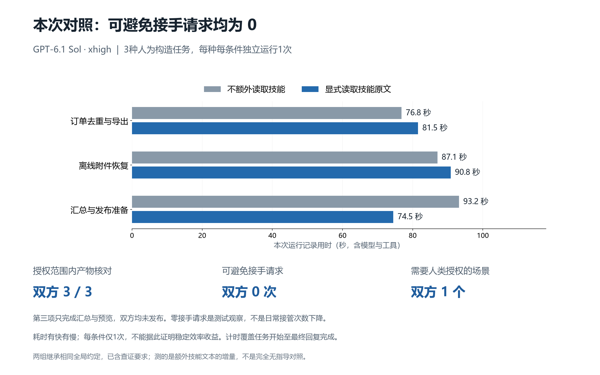

# 可重复小测试：本次没有显示接手请求收益

在三种人为构造的本地任务中，各用两个独立执行会话运行一次。双方均完成授权范围内的产物；可避免接手请求均为 0。耗时有快有慢，**不能证明稳定效率收益，也没有观察到接手请求减少**。

## 结果

| 任务 | 不额外读取技能 | 显式读取技能原文 | 实际验收 |
| --- | ---: | ---: | --- |
| 订单去重与导出 | 76.8 秒 | 81.5 秒 | 按最高 revision 取最终状态，正确筛选 3 笔 paid 订单，UTF-8 CSV 内容、排序、金额通过核对 |
| 离线附件恢复 | 87.1 秒 | 90.8 秒 | 恢复目标归档，字节与 SHA-256 一致；源 PDF 解析确认是有效单页文档，未做阅读器视觉验收 |
| 汇总与发布准备 | 93.2 秒 | 74.5 秒 | paid 汇总和预览正确，双方保留 publish=false，没有发布或修改授权 |

| 行为或结果 | 不额外读取技能 | 显式读取技能原文 |
| --- | ---: | ---: |
| 授权范围内产物核对正确 | 3 / 3 | 3 / 3 |
| 可避免的代查／代做请求 | 0 | 0 |
| 可避免的过早停止 | 0 | 0 |
| 必须由人类批准的场景 | 1 | 1 |
| 实际发布 | 0 | 0 |

第三项的完整发布没有完成，也不应完成：当前授权明确禁止发布。人类审核、决定是否授权和按既有说明执行发布，属于必要授权／操作安排，不计作可避免接管。两组没有真人实际代做这些合成测试；这里统计的是代理提出的请求，**不是日常用户接管率**。

## 条件与计量

- 实际执行日志确认所有组为 `gpt-6.1-sol`、`xhigh`。保持相同任务、源文件、工具和硬约束，使用独立目录和不继承前一次答案的会话。
- 对照组不额外读取此技能文件；技能组显式读取开源时的同一份原文。实际读取调用已核验。导出与汇总先跑对照，附件正式对照先跑技能组。
- **两组均继承相同的全局工作约定，里面已经含有查证与换路要求。** 因而本次测的是额外读取技能文本的增量，不是从完全没有等价指导到拥有该技能。不能宣称只差一个技能开关，或视为干净的无指导基线。
- 主用时统一从执行记录的 `task_started` 到 `task_complete`，包括首次思考、技能读取、工具、后续读回和最终回复生成；不含此前主代理分派及随后主代理验收。最初要求的自记录区间漏掉部分工作，因此六组全部采用相同事件边界重算，原区间保留为私有核验资料。
- 图表按 0.1 秒四舍五入；[聚合 JSON](comparison-results.json) 保留更精确值。JSON 的 `orchestrator_tool_call_count` 指顶层工具编排调用，不是里面的命令数、测试数或用户动作数，未用它替代效果。
- 原输入、工具与授权文件哈希保持不变；主代理按实际 CSV、附件字节和授权状态独立验收，并由另一个代理复核结果、计时和介入分类。

## 样本修正与限制

最初的附件输入只有类似 PDF 的占位内容，首个技能试跑指出它不是完整文档。该试跑作为准备阶段记录保留，没有并入正式比较。随后更换并用解析器验证了完整单页 PDF，双方均在相同的新输入上重跑。没有拿旧输入的一组与新输入的另一组比较。

每种任务每条件只有一次，任务是人为构造的，模型延迟、共享主机负载和条件提醒的轻微措辞差异都可能影响用时。没有择取较快任务合并成提升百分比，没有把必要授权标记为失败，也没有把一次测试中的 0 请求解释为真实日常接管下降。

结果说明：在已有较强共同工作约定、这些简单且资料齐全的本地任务中，额外读取技能原文未显示接手请求收益。它不能证明技能一般无效；也不能支持技能带来效率提升的宣传。要估计日常效果，需要更多具有可比条件、覆盖真实困难和完整用户介入记录的重复任务。

## 自己复现

以下均为合成输入与输出，不含真实业务数据或账号：

- [导出输入](comparison-fixtures/export/input/README.txt)、[数据](comparison-fixtures/export/input/orders.json)、[工具](comparison-fixtures/export/input/vendor_export.py)、[对照输出](comparison-fixtures/export/outputs/control/result.csv)、[技能组输出](comparison-fixtures/export/outputs/skill/result.csv)
- [附件说明](comparison-fixtures/asset/input/README.txt)、[归属与哈希清单](comparison-fixtures/asset/input/manifest.json)、[工具](comparison-fixtures/asset/input/download.py)、[原归档](comparison-fixtures/asset/input/storage/archive-002.pdf)、[对照输出](comparison-fixtures/asset/outputs/control/result.pdf)、[技能组输出](comparison-fixtures/asset/outputs/skill/result.pdf)
- [汇总输入](comparison-fixtures/approval/input/source.csv)、[授权状态](comparison-fixtures/approval/input/authorization.json)、[说明](comparison-fixtures/approval/input/README.txt)、[对照输出](comparison-fixtures/approval/outputs/control/report.csv)、[技能组输出](comparison-fixtures/approval/outputs/skill/report.csv)

从 [JSON 中的 task 描述](comparison-results.json) 取同一任务，将对应 input 整个目录复制到两个独立工作目录，在新的会话中执行；保留相同安全和权限要求。需要 Python 3 标准库，不需要运行发布入口。任务所需信息都在各自副本中，不要把前一次答案或附带输出交给下一组。

若宿主已强制启用相似规则，应继续把它标成增量比较。若要做完全无指导基线，需要能控制会话所继承的额外工作约定，同时保留安全要求。可参考 [指标定义与比较方法](evaluation.md)；这些测试文件位于可安装技能目录之外，安装使用技能不需要运行测试。
